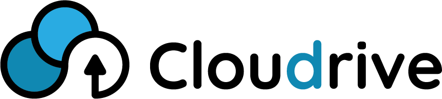

| C++ | QT |
|--|--|

  
**CloudDrive**  application allows you to store data and to manage uploaded resources on a remote server.

##
### Server
The server application consists of two main user windows:
> Application configuration and action selection window

#### Starting the server
To start the server, specify the IP address and port.
For the correct operation of the application, you must also configure the path to the database once.

 - RUN  - starts the server
 - Server status - displays basic server information like port and launch time
 - STOP - stops the server

> User list window 
> 	

  
After the user registers on the server in the **Users** tab, a record with its data will appear. In order to edit user's data or delete it, it is necessary to click on the record corresponding to the given user. 
User passwords are encrypted by default.

All files uploaded by users are stored in the working directory of the server application. Directory names correspond to user names.
##
### Client 

In order to connect to the server, it is necessary to provide the correct IP address and port.
After the connection has been correctly established, it is necessary to register, after which you can log in to your client's panel.

  
After logging in, we gain access to the user panel.

 - To download a given element from the server resources remember to **select it** and press the **Download the selected file** button. 
 - To delete a given element from the server resources remember to **select it** and press the **Delete file** button. 

##
When using the server and client applications you will get various notifications informing about the course of a given process.

##
 [theme](https://github.com/ColinDuquesnoy/QDarkStyleSheet) [icons](https://www.flaticon.com/)
##
